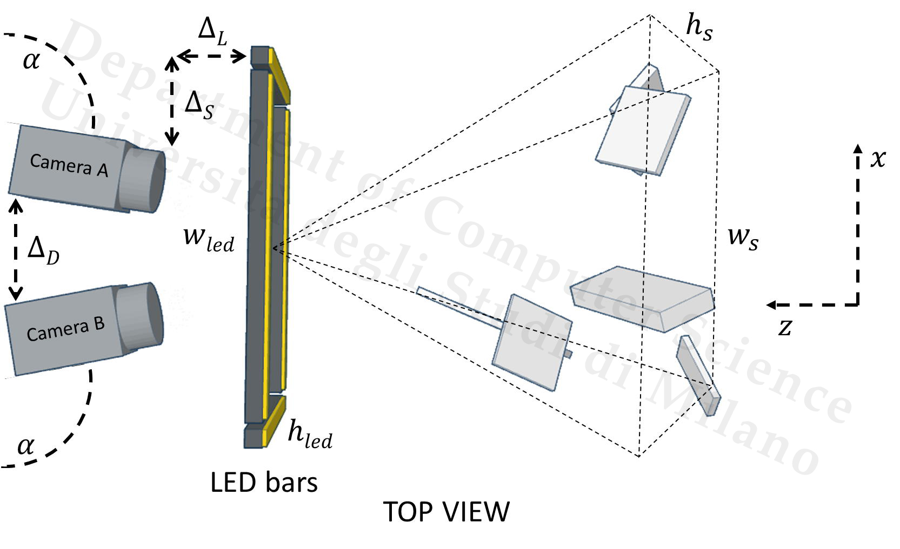
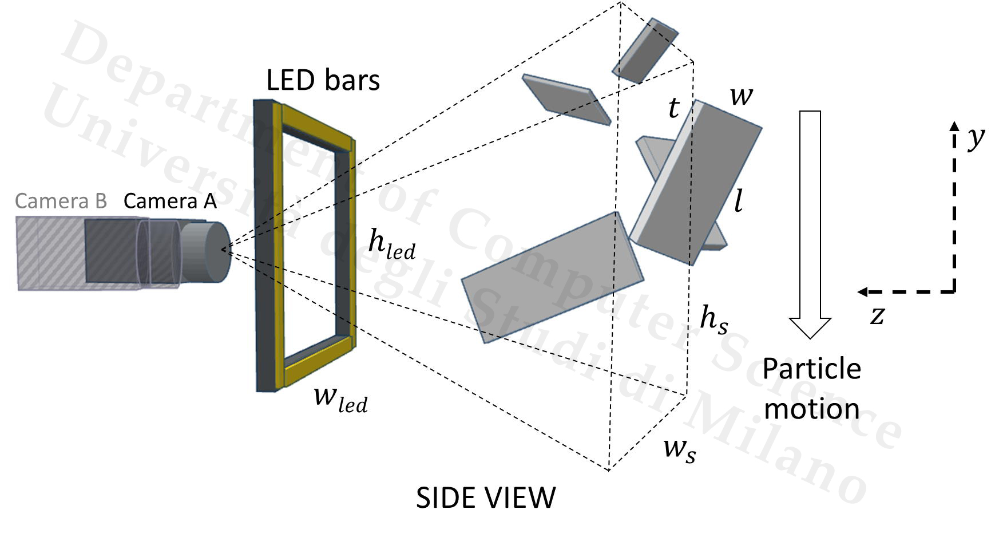

<div align="center">

# 🪵 IPAN 3D

### 3-D Granulometry Using Image Processing

[](https://www.mathworks.com/products/matlab.html)
[](LICENSE)
[](https://ieeexplore.ieee.org/document/8411142)
[](http://iebil.di.unimi.it/projects/ipan)
[](https://github.com/AngeloUNIMI/Granulo-10k)

**MATLAB source code for the IEEE Transactions on Industrial Informatics paper**  
*3-D Granulometry Using Image Processing*

</div>

---

## ✨ Overview

**IPAN 3D** is a MATLAB implementation for estimating the **three-dimensional granulometry** of particles using image processing techniques.  
The project targets industrial scenarios where the size distribution, shape, and geometry of particles or material fragments must be measured automatically from images.

The method was presented in the IEEE TII 2019 paper:

> R. Donida Labati, A. Genovese, E. Muñoz, V. Piuri, and F. Scotti,  
> **“3-D Granulometry Using Image Processing,”**  
> *IEEE Transactions on Industrial Informatics*, vol. 15, no. 3, pp. 1251–1264, March 2019.

---

## 🧭 Processing Workflow

<div align="center">


</div>

The pipeline combines stereo captures and calibration information to estimate particle dimensions and produce granulometric measurements suitable for industrial analysis.

---

## 🖼️ Visual Examples

<div align="center">




</div>

---

## 📁 Repository Structure

```text
IPAN_3D/
│
├── Code/                         # MATLAB source code
│   └── launch_IPAN_caduta_size    # Main entry point
│
├── Dati_recenti_DEMO/             # Demo database of recent stereo captures
├── Dati_storici_DEMO/             # Demo database of historical data
├── calib_ren/                     # Calibration resources
│
├── fileParametriTutti.txt         # Parameter file
├── numcams.txt                    # Camera configuration
├── tempcode.txt                   # Auxiliary configuration/code file
│
├── README.md
└── LICENSE
```

---

## 🚀 Getting Started

### 1. Clone the repository

```bash
git clone https://github.com/AngeloUNIMI/IPAN_3D.git
cd IPAN_3D
```

### 2. Open MATLAB

Start MATLAB and move to the repository folder:

```matlab
cd('path/to/IPAN_3D')
```

### 3. Check the demo data

The repository includes demo stereo-capture data in:

```text
Dati_recenti_DEMO/
Dati_storici_DEMO/
```

The current README identifies `Dati_recenti_DEMO` as the required database of stereo captures for the main demo.

### 4. Run the main script

From MATLAB, launch:

```matlab
run('./Code/launch_IPAN_caduta_size')
```

Depending on your MATLAB path configuration, you may need to add the source tree first:

```matlab
addpath(genpath('./Code'))
run('./Code/launch_IPAN_caduta_size')
```

---

## 📊 What the Code Does

IPAN 3D is designed for automatic granulometric analysis from image data.

| Stage | Purpose |
|---|---|
| Stereo acquisition | Uses paired views of falling or moving particles |
| Calibration | Uses camera calibration information to support 3-D reasoning |
| Image analysis | Extracts visual information from captured particle images |
| 3-D estimation | Estimates particle geometry from multi-view data |
| Granulometry | Produces size-related measurements for industrial analysis |

---

## 🔗 Related Dataset: Granulo-10k

For newer work on industrial granulometry, see the related repository:

[**Granulo-10k — A large-scale benchmark dataset for multiple-view industrial granulometry of OSB wood strands**](https://github.com/AngeloUNIMI/Granulo-10k)

Granulo-10k provides a modern benchmark with:

- **9,600 RGB images** at `1280 × 960`
- **200 OSB wood strands**
- **24 acquisitions per strand**
- **2 synchronized camera views** per acquisition
- segmentation masks
- 3-D point clouds
- ground-truth height, width, and thickness measurements

<div align="center">


</div>

---

## 📖 Paper

If you use this repository, please cite:

```bibtex
@Article{ipan3d,
  author  = {R. {Donida Labati} and A. Genovese and E. Muñoz and V. Piuri and F. Scotti},
  title   = {3-D granulometry using image processing},
  journal = {IEEE Transactions on Industrial Informatics},
  volume  = {15},
  number  = {3},
  pages   = {1251--1264},
  month   = {March},
  year    = {2019},
  note    = {1551-3203}
}
```

Paper: [IEEE Xplore](https://ieeexplore.ieee.org/document/8411142)  
Project page: [IPAN 3D Project](http://iebil.di.unimi.it/projects/ipan)

---

## 👥 Authors

- **Ruggero Donida Labati**
- **Angelo Genovese**
- **Enrique Muñoz**
- **Vincenzo Piuri**
- **Fabio Scotti**

Department of Computer Science  
Università degli Studi di Milano, Italy

---

## 📄 License

This project is released under the **GNU General Public License v3.0**.

See the [LICENSE](LICENSE) file for details.

---
